# IFC Catering App

Welcome to the IFC Catering App! This guide list the features and functionalities of Caterers App in brief.

## Table of Contents
- [Dashboard & Shift Timer](#dashboard--shift-timer)
- [Flight List & Pairing](#flight-list--pairing)
- [Preparations](#preparations)
- [Deliveries](#deliveries)
- [Spot Checks](#spot-checks)
- [Memos](#memos)
- [Documents](#documents)

---

## 1. Dashboard & Shift Timer

The **Dashboard** is your home screen. It provides a quick overview of your current status and essential actions.

### Shift Timer
The shift timer helps you track your work hours accurately.
- **ON**: Tap to start your shift. The timer begins tracking your active time.
- **BREAK**: Use this when taking a break. It pauses your work timer.
- **OFF**: Tap this to end your shift.

> 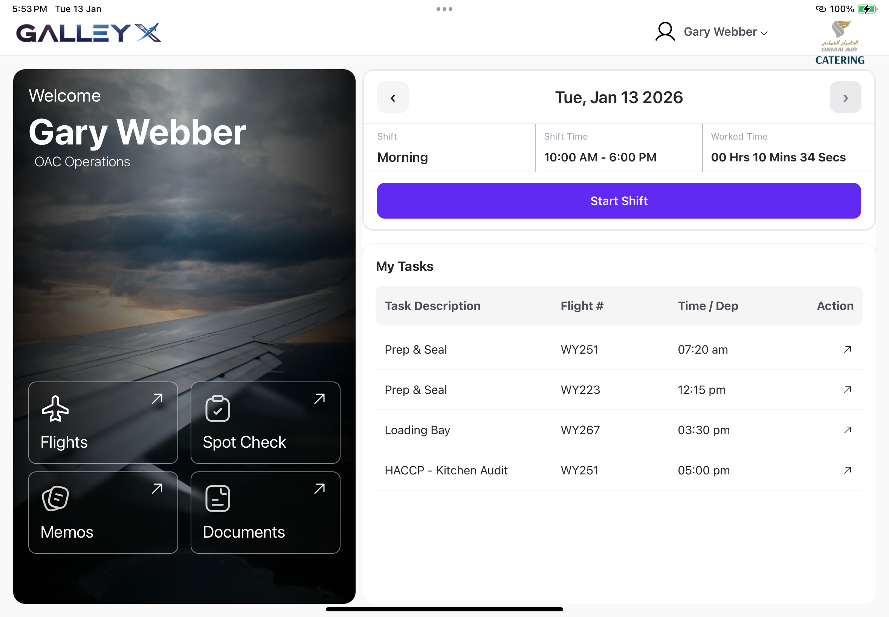
> *dashboard screen*

---

## 2. Flight List & Pairing

The **Flight List** displays all scheduled flights relevant to your catering tasks. 

- **View Flights**: Scroll through the list to see flight details such as flight number, destination, and departure time.
- **Pairing**: Flights are often paired (e.g., an inbound and an outbound flight). The app groups these together so you can manage resources efficiently between them.

> 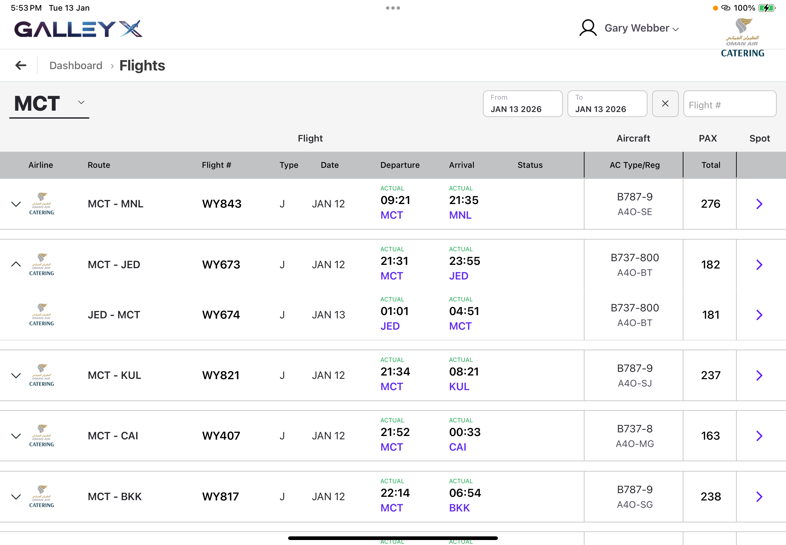
> *flight list view*

---

## 3. Preparations

The **Preparations** section is where you manage the catering items for each flight.

### Key Features
- **Preparation List**: A detailed checklist of all items required for the selected flight.
- **Filters**: Use filters to narrow down items by category (e.g., Beverages, Meals) or status (e.g., Pending, Completed).

### Prep Actions
- **Mark as Prepared**: Swipe or tap on an item to mark it as ready.
- **Scan to Prepare**: Use the built-in camera scanner to scan item barcodes. This automatically marks the corresponding item as prepared in your list, saving time and reducing errors.

> 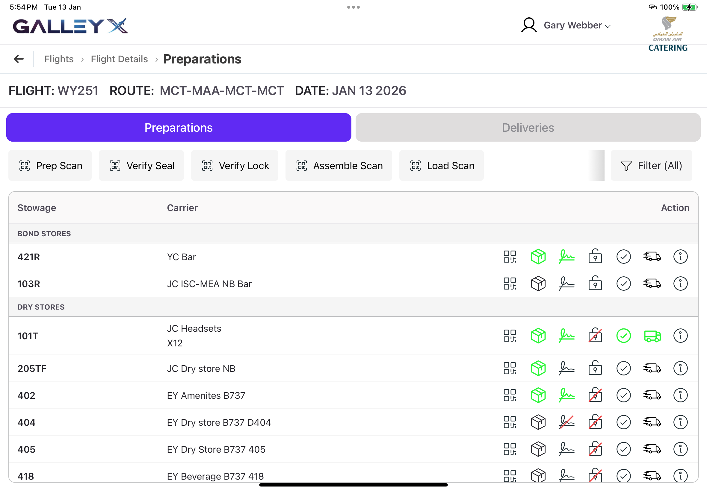
> *preparations tab*

> 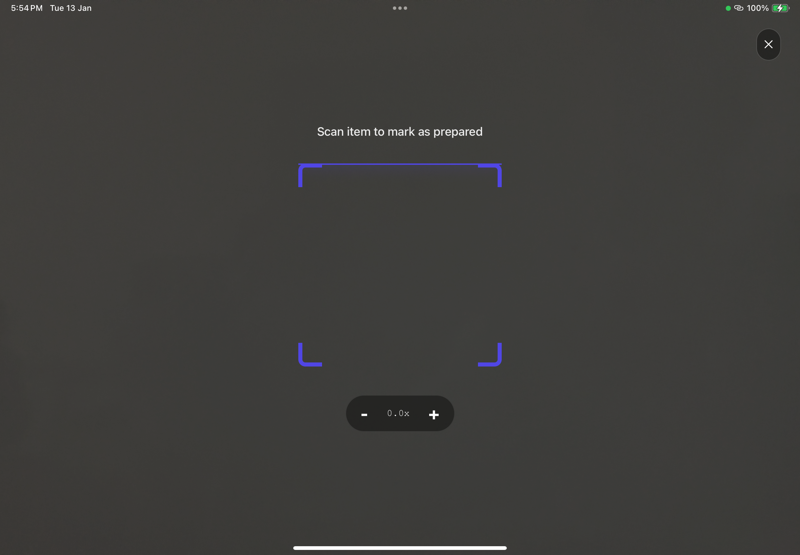
> *scanning via camera*

---

## 4. Deliveries

The **Deliveries** screen manages the handover and compliance process. It ensures all security and safety protocols are met before dispatch.

> 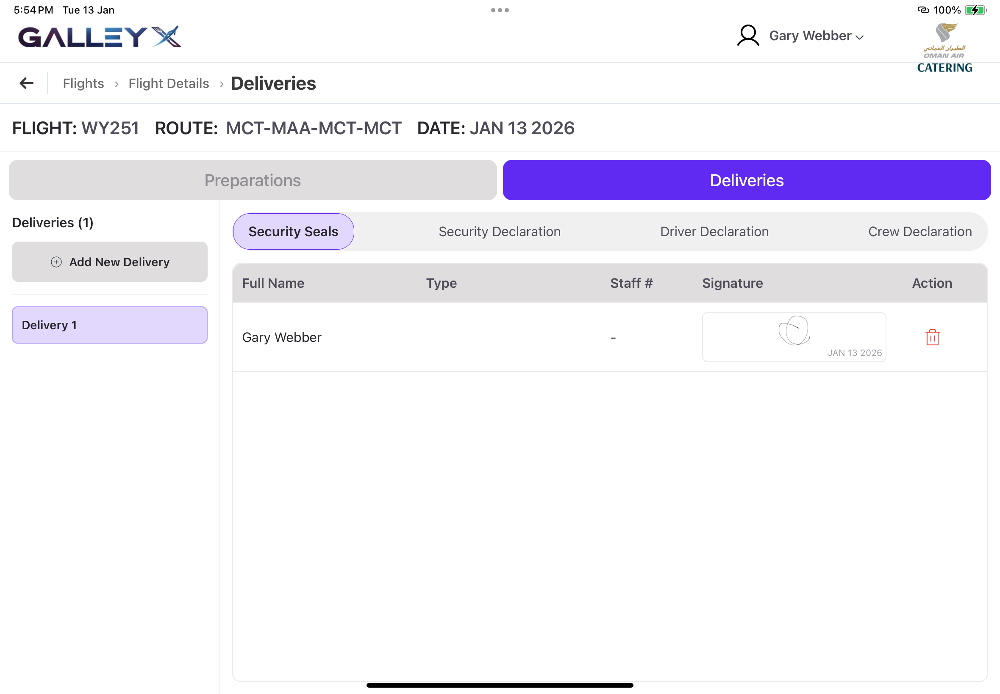
> *Deliveries tab*

### Tabs Overview
The section is divided into specific tabs for different personnel:

1. **Security Seals**: Manage and verify seal numbers for carts and containers.
2. **Security Declaration**: For security staff to sign off on checks.
3. **Driver Declaration**: For the driver to confirm receipt and secure loading.
4. **Crew Declaration**: For the cabin crew to acknowledge receipt of catering.

Each tab allows for digital signatures and timestamped verification.

> 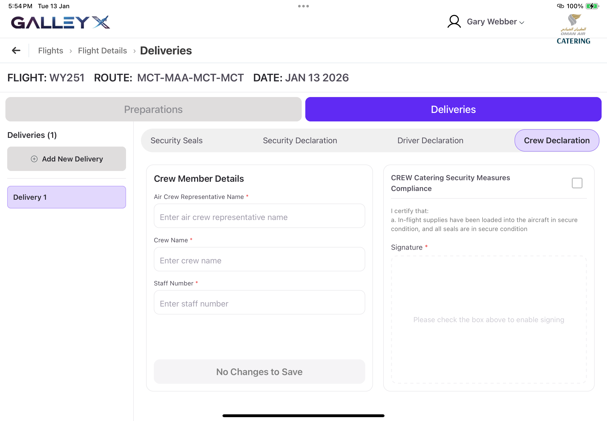
> *Crew Declaration Tab*

---

## 5. Spot Checks

Ensure quality and compliance with the **Spot Check** feature.

- **Scan to Do Spot Check**: Initiates a random or targeted check on items.
> 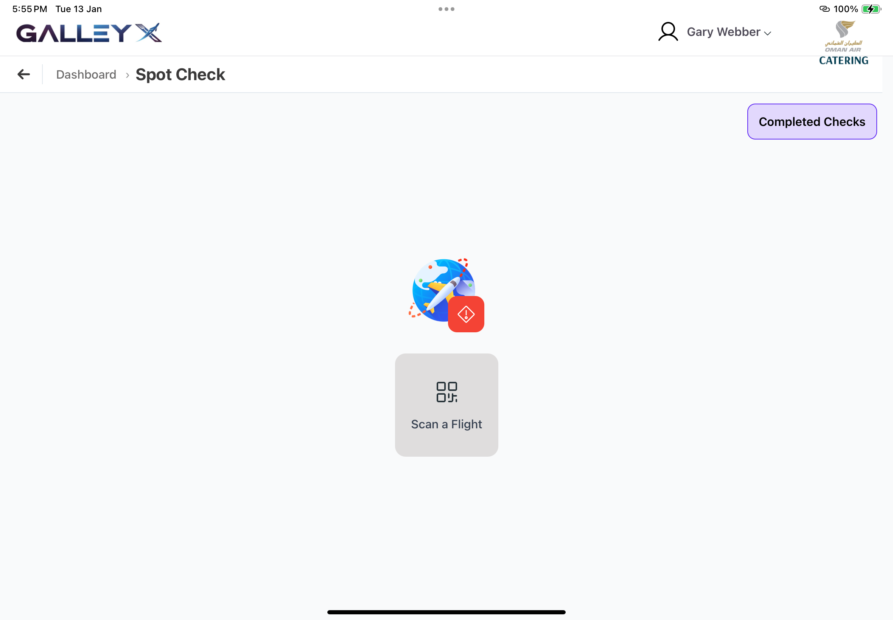
> *scan screen - spot check*
- **Pass/Fail**: Quickly mark items as "Pass" or "Fail" based on their condition or quantity.
> 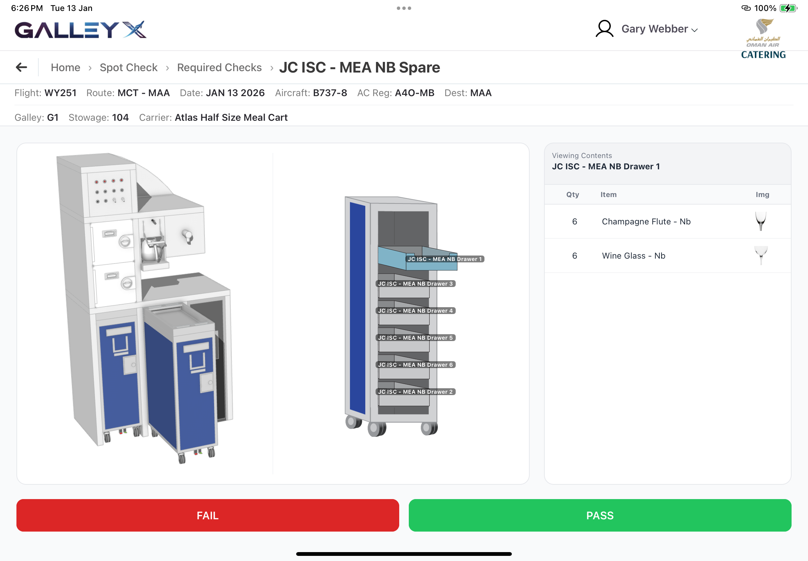
> *spot check screen*

> 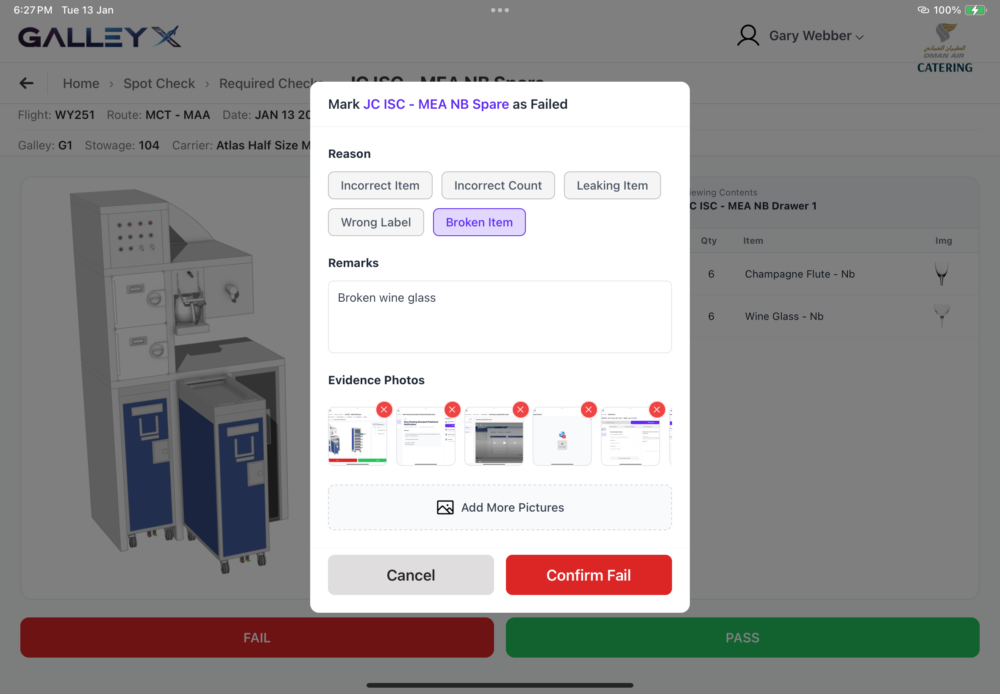
> *failure submission*
- **Completed Checks**: View a history of all spot checks performed for the current flight to ensure nothing was missed.

> 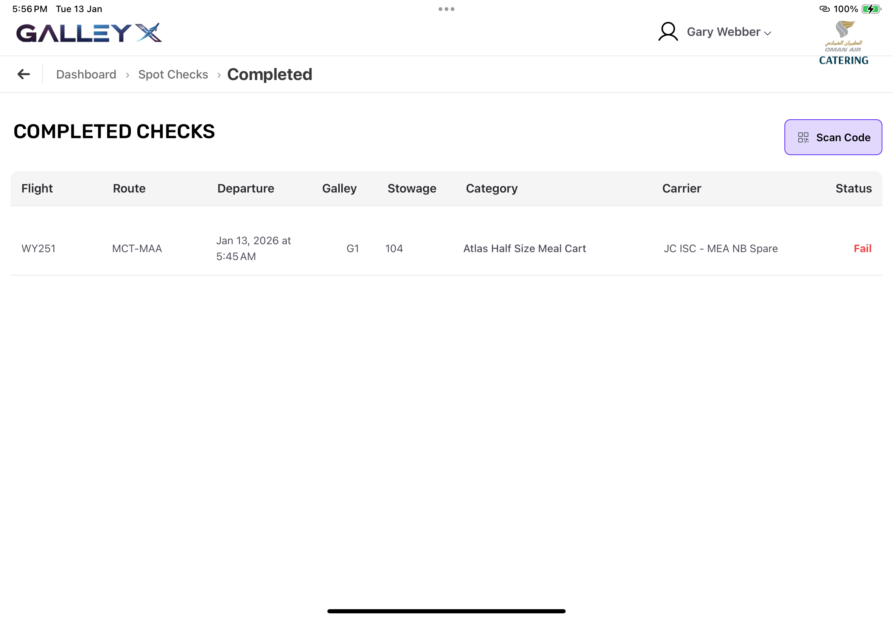
> *completed checks list*

---

## 6. Memos

Stay updated with important communications via the **Memos** section.
> 
> *Memo list*

- **Inbox**: View new memos from management or dispatch.
- **Acknowledged Memos**: Access memos you have already read and signed off on.
- **Versions**: If a memo is updated, the app tracks versions so you always see the latest information while retaining a history of previous instructions.

> 
> *Memo details*

---

## 7. Documents

Access reference materials directly within the app.

- **Supported File Types**: The app supports viewing of common document formats (e.g., PDF) for catering manuals, safety guides, and menu specifications.
- **Viewer**: Tap on any document to open it in the full-screen viewer.

> 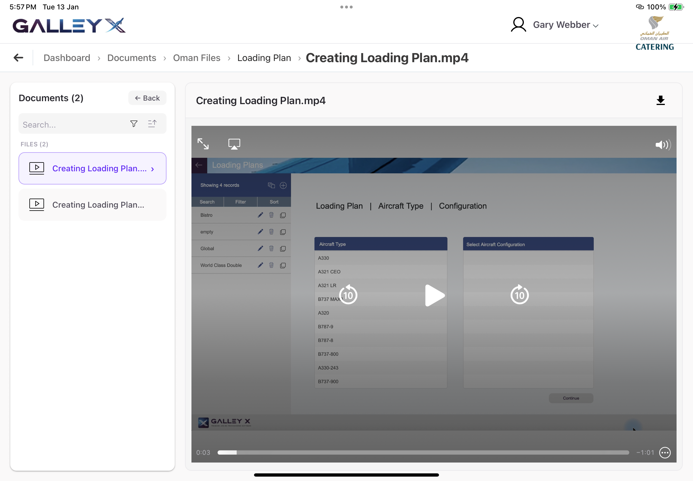
> *Documents section*
